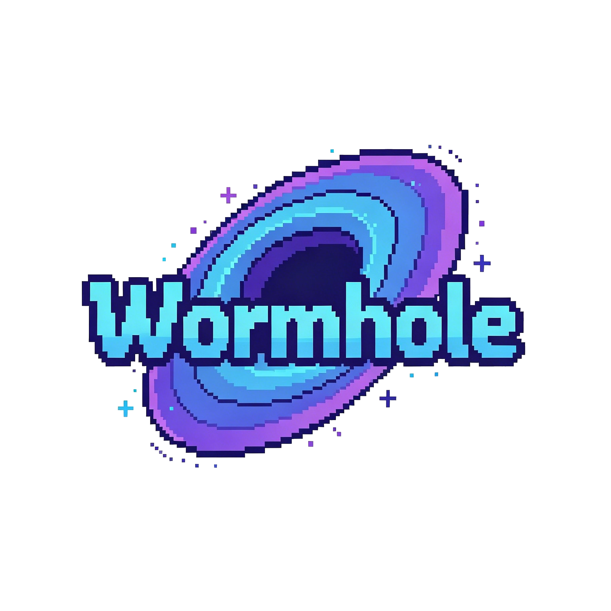
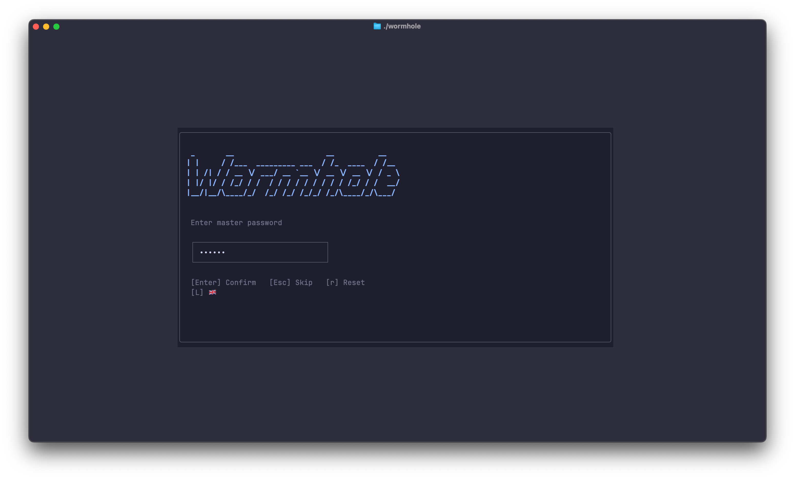
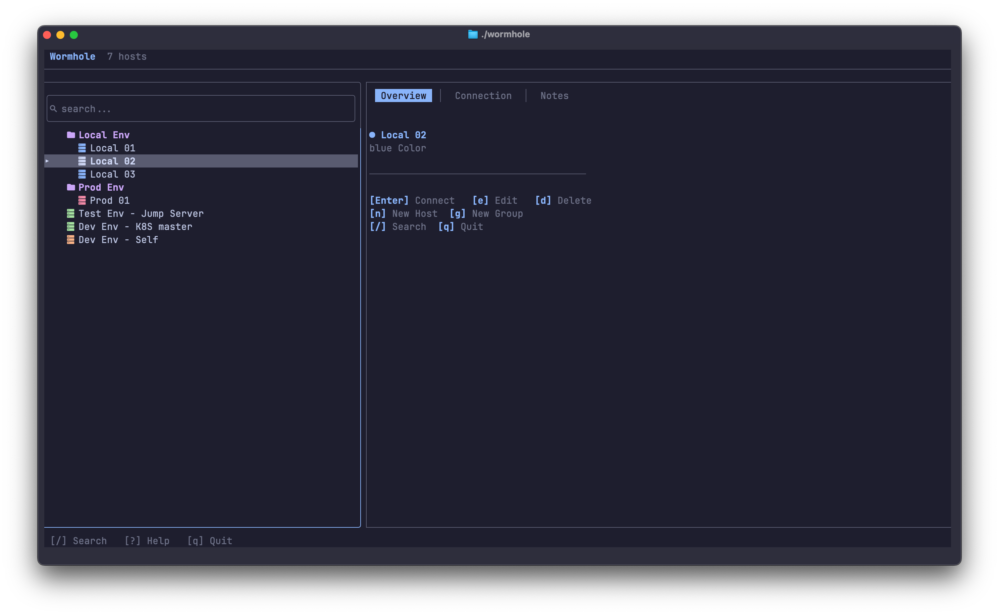
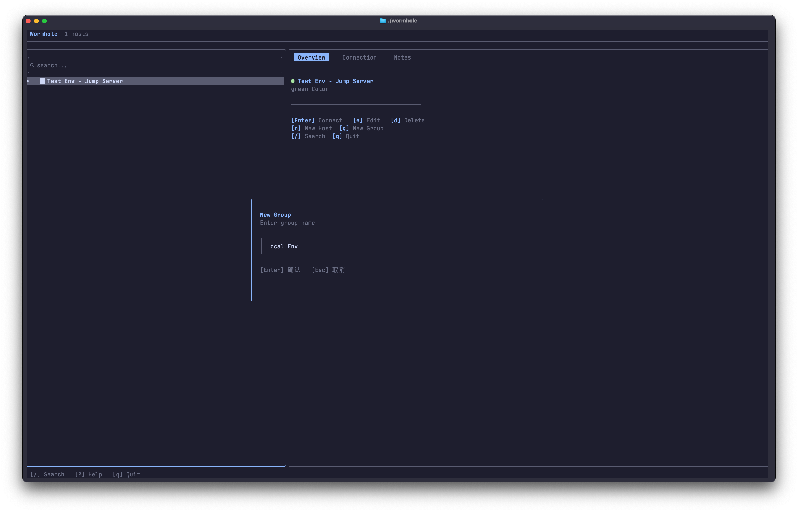
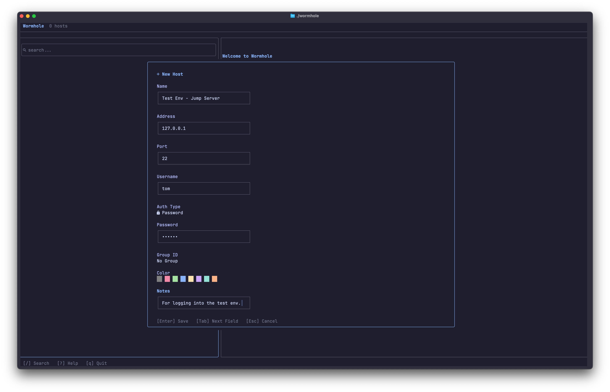

<div align="center">
  
</div>

# Wormhole

[English](../README.md) | [中文](README.zh.md) | [日本語](README.ja.md) | **한국어**

Rust로 작성된 빠르고 안전하며 아름다운 터미널 SSH 연결 관리자.

Wormhole을 사용하면 세련된 TUI 인터페이스에서 SSH 서버를 관리하고 연결할 수 있습니다 — 호스트를 그룹화하고, AES-256-GCM으로 자격 증명을 암호화하며, 단일 키 입력으로 연결하세요.

## 스크린샷

<div align="center">
  
  
</div>
<div align="center">
  
  
</div>

## 기능

- 암호화 비밀번호 금고 (AES-256-GCM + Argon2id)
- 접을 수 있는 폴더로 호스트 그룹화
- Shift+J/K로 호스트 및 그룹 순서 변경
- 호스트 이름, 주소, 그룹 전체의 전체 텍스트 검색
- 실시간 미리보기가 포함된 4가지 내장 색상 테마
- 선택적 마스터 비밀번호 — 건너뛰고 일반 텍스트로 저장 가능
- 전체적으로 Nerd Font 아이콘 사용

## 요구 사항

- [Nerd Font](https://www.nerdfonts.com/)가 설치되어 있고 터미널 글꼴로 설정되어 있어야 함 (예: JetBrains Mono Nerd Font)
- [sshpass](https://sourceforge.net/projects/sshpass/) (비밀번호 기반 SSH 연결용)
- Rust 1.85+ (edition 2024)

### Nerd Font 설치

Wormhole 인터페이스 전체에 Nerd Font 아이콘이 사용됩니다. 아이콘이 네모나 물음표로 표시되면 Nerd Font를 설치하세요:

```bash
# macOS
brew install --cask font-jetbrains-mono-nerd-font

# Linux
mkdir -p ~/.local/share/fonts && cd ~/.local/share/fonts
curl -fLO https://github.com/ryanoasis/nerd-fonts/releases/latest/download/JetBrainsMono.zip
unzip JetBrainsMono.zip && rm JetBrainsMono.zip
fc-cache -fv
```

설치 후 터미널 설정에서 글꼴을 "JetBrainsMono Nerd Font"로 변경하세요.

## 설치

```bash
git clone https://github.com/wormhole-ssh/wormhole.git
cd wormhole
cargo build --release
cp target/release/wormhole /usr/local/bin/
```

## 사용법

터미널에서 `wormhole`을 실행하세요.

### 첫 실행

마스터 비밀번호를 설정하라는 메시지가 표시됩니다. 이 비밀번호는 로컬 금고(`~/.wormhole/vault.enc`)에 저장된 SSH 자격 증명을 암호화합니다. 이 단계를 건너뛰면 비밀번호가 일반 텍스트로 저장됩니다(`~/.wormhole/passwords.json`).

### 단축키

| 키 | 동작 |
|----|------|
| `j` / `↓` | 아래로 이동 |
| `k` / `↑` | 위로 이동 |
| `h` / `l` | 패널 포커스 전환 |
| `Enter` | 호스트에 연결 |
| `e` | 선택 항목 편집 |
| `d` | 선택 항목 삭제 |
| `n` | 새 호스트 만들기 |
| `g` | 새 그룹 만들기 |
| `/` | 검색 |
| `Tab` | 상세 탭 전환 |
| `t` | 테마 전환 |
| `Shift+J/K` | 항목 순서 변경 |
| `?` | 도움말 |
| `q` | 종료 |
| `Esc` | 취소 / 뒤로 |

### 데이터 저장

모든 데이터는 `~/.wormhole/` 디렉터리에 저장됩니다:

| 파일 | 설명 |
|------|------|
| `config.toml` | 호스트, 그룹 및 설정 |
| `vault.enc` | 암호화된 비밀번호 금고 (마스터 비밀번호 설정 시) |
| `passwords.json` | 일반 텍스트 비밀번호 (마스터 비밀번호 건너뛸 시) |

## 보안

마스터 비밀번호를 설정하면 Wormhole은 다음을 사용합니다:
- 키 파생에 **Argon2id** (m=65536, t=3, p=4)
- 인증된 암호화에 **AES-256-GCM**
- 금고 암호화를 위한 설치별 임의 솔트
- 마스터 비밀번호 해시를 위한 비밀번호별 임의 솔트

> **참고:** 비밀번호 기반 SSH 연결은 `sshpass`를 사용하며, 비밀번호를 명령줄 인수로 전달합니다. 시스템의 다른 사용자가 `ps aux`를 통해 이를 확인할 수 있습니다. 더 나은 보안을 위해 키 기반 인증을 사용하는 것을 권장합니다.

## 테마

Wormhole에는 4가지 테마가 포함되어 있습니다:
- **Catppuccin Mocha** (기본값)
- **Tokyo Night**
- **Dracula**
- **Gruvbox Dark**

`t` 키를 눌러 테마 선택기를 엽니다. 화살표 키로 미리보고, Enter로 저장합니다.

## 라이선스

[MIT](LICENSE)
